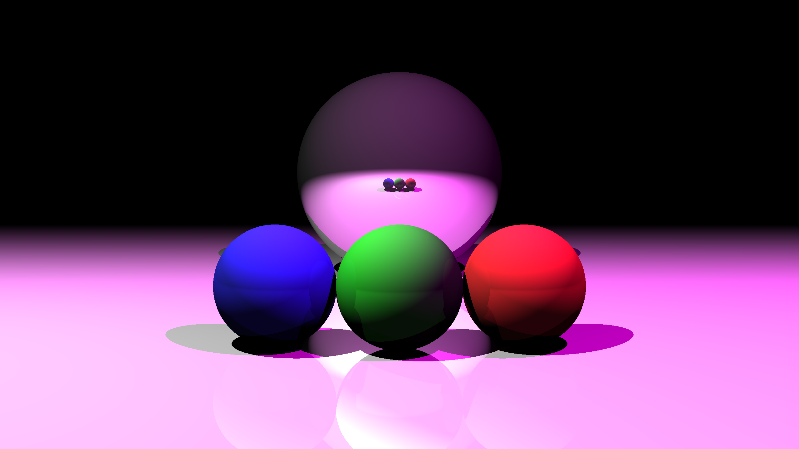

# Projet IN204 : Ray Tracing

### Bordeau Pierre & Brisset Arnaud



Ce projet effectué dans le cadre du cours IN204 est une implémentation en C++ d'un moteur de Ray Tracing. Il est assez élémentaire en terme d'objets et de types de lancés de rayons, mais permet de générer des images avec un éclairage réaliste (et plutôt esthétique).

PS : Nous avons utilisé l'extension Live Share sur VS Code pour pouvoir collaborer en temps réel. Ainsi, une partie des commits attribuées à Pierre contiennent aussi du code attribué à Arnaud.


## Compilation

Il faut utiliser a minima C++17 (nécessaire pour la manière dont nous initialisons les tuples pour les couleurs, mettant entre crochets les 3 valeurs)

La compilation se fait dans le dossier racine du projet, en compilant simplement le fichier `main.cpp` :

```bash
g++ -std=c++17 main.cpp -o raytracer.x
```

On peut ensuite lancer le programme en lui fournissant un fichier de description de scène et le nom de fichier de sortie en argument :

```bash
./raytracer.x input/scene1.txt output_images/scene1.ppm
```

L'image générée est au format PPM peut être visualisée avec un visionneur d'image compatible.

## Description de la scène

Le fichier de description de scène est un fichier texte contenant les informations suivantes :

Informations sur la caméra :
- Position de la caméra (3 coordonnées)
- Vecteur de visée de la caméra (3 coordonnées)
- Champ de vision (FOV), en degrés
- taille de l'image (hauteur et largeur)
- Nombre de rebonds pour les rayons de réflexion spéculaire

Liste d'objets, pouvant être de type :

Sphere :
- Position (3 coordonnées)
- Rayon
- Couleur (3 valeurs entre 0 et 1)
- Coefficient de réflexion diffuse (entre 0 et 1)
- Coefficient de réflexion spéculaire (entre 0 et 1)

Plan :
- Position (3 coordonnées)
- Vecteur normal (3 coordonnées)
- Couleur (3 valeurs entre 0 et 1)
- Coefficient de réflexion diffuse (entre 0 et 1)
- Coefficient de réflexion spéculaire (entre 0 et 1)

Source de lumière ponctuelle :
- Position (3 coordonnées)
- Couleur (3 valeurs entre 0 et 1)

Voici un exemple :

```
camera
{ 0 0 0 } { 0 1 0 } 90 400 600 { 0 0 0 } 6

sphere
{ 0 10 4 } 3 { 1 1 1 } 0 1

plane
{ 0.0 0 -1 } { 0 0 1 } { 1 1 1 } 0.8 0.5

light
{ 3 2 5 } { 1 0 0 }

light
{ -3 2 5 } { 0 0 1 }
```
